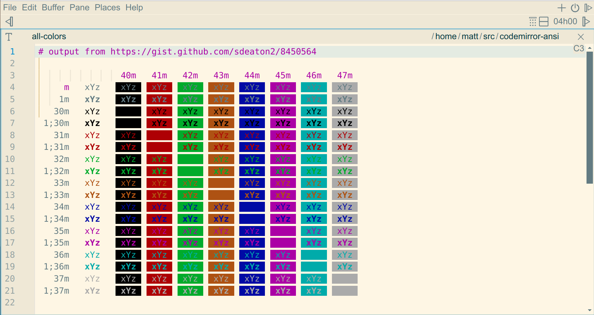
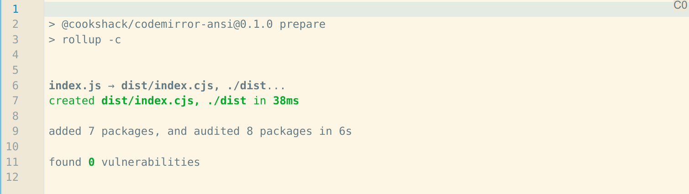

# @cookshack/codemirror-ansi

ANSI escape code handling for [CodeMirror 6](https://codemirror.net/).

Currently only affects Select Graphic Rendition sequences (the color escapes):
1. hides control chars
2. displays/clears 4 bit fg/bg colors and bold

## Screenshots





## Example

```javascript
window.view = new EditorView({
  extensions: [ ansi(), ...
```

## Build from source

```
$ npm i # only needed first time
$ npm run prepare
```
